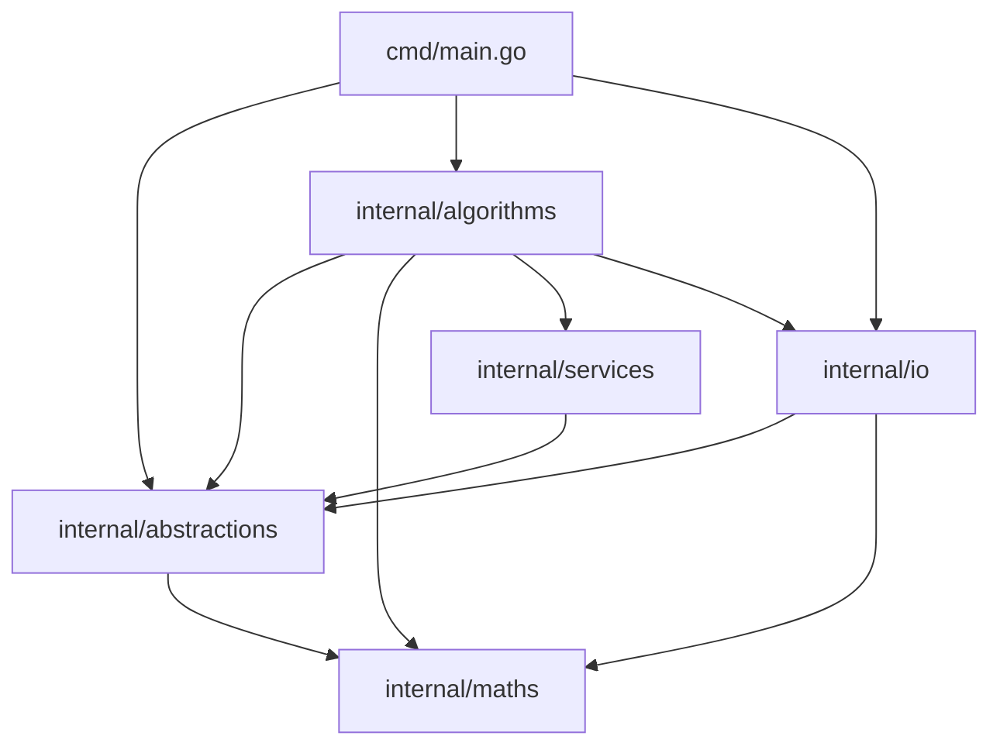

# Day 12 – Present Packing Under Christmas Trees

This day models a **2D packing** problem: you’re given a fixed set of weird 3×3 present silhouettes (cells are either occupied `#` or empty `.`), and for each Christmas tree you’re given a rectangular region plus a shopping list of how many presents of each shape must fit.

A placement is valid if:

- Presents are aligned on the unit grid.
- Presents can be **rotated** and **flipped**.
- Occupied cells may not overlap.
- Holes (`.`) in a shape do **not** block other presents.

The program counts how many trees’ regions can be fully packed with their required presents.

---

## High-level approach

The implementation uses two main ideas:

1. **Precompute “good” pairwise combinations of shapes** (under rotations / flips / limited vertical shifts) to get higher-density pieces.
2. **Greedily place** the densest combined pieces first, then place leftover single presents.

This isn’t a full exact tiling/ILP solver. It’s a pragmatic approach that performs well for the puzzle input while keeping the code approachable.

---

## Module dependencies

The solution is split into small internal packages. At a high level:



---

## Input parsing

Parsing is handled by `internal/io/cavern_reader.go`.

- Each shape is read as 3 lines of `#` / `.`, converted into a 3×3 `[][]int8` grid.
- Empty cells use a sentinel constant `E = -99` (not `0`, because present index `0` is a valid ID).
- Each tree line is parsed as:

  ```text
  <wide>x<long>: c0 c1 c2 c3 c4 c5
  ```

  and becomes a `ChristmasTree` with a `Region` of that size and a map of required counts by present index.

---

## Core abstractions

### Shapes and density

`internal/abstractions/shape.go`

A `Shape` is:

- `Cells [][]int8` – the 2D grid.
- `Dimension` – `Wide` and `Long`.
- `FillRatio` – occupancy ratio computed by `ComputeFillRatio`.

`FillRatio` is the main heuristic measure of “goodness”: denser shapes are usually easier to place without leaving unusable holes.

### Region and tree configuration

- `internal/abstractions/christmas_tree.go` holds the region size and remaining present counts.
- `internal/maths/region.go` holds the mutable 2D grid used during packing.

---

## Precomputing combined shapes (pairwise permutations)

`internal/algorithms/shape_permutations.go`

Before packing any tree, the code precomputes how two present shapes can be “combined” into a single composite shape.

### Transformations (rotations / flips)

3×3 transformations live in `internal/maths/slice_extensions.go`:

- `RotateClockwise`
- `VerticalFlip`
- `HorizontalFlip`
- `NoOp`

### Combining two shapes

The actual merge logic is implemented in `internal/algorithms/combine_presents.go` via:

- `CombinePresents(fixedID, fixedShape, movingID, movingShape, slideOffset, verbose) Shape`

At a high level:

1. Optionally **slide** the moving shape down by `slideOffset`.
2. Compute the horizontal packing offset (how far the moving shape can shift without overlap).
3. Create a new canvas sized to hold both pieces.
4. Paste both shapes into the canvas (using their indices as cell values).
5. Compute `Dimension` and `FillRatio` for the merged shape.

### Choosing the “best” combination

`internal/services/combination_catalog.go` stores candidate combinations and keeps the most “optimal” ones based on `FillRatio`.

---

## Placing shapes into a region

Placement is implemented in `internal/algorithms/pack_shape.go`:

- `PackShape(region, presentIndex, shape, verbose) bool`

It searches for an insert position where all occupied cells of the shape fit inside empty cells of the region, then writes the shape into the region.

---

## Packing strategy per Christmas tree

Packing orchestration is implemented in `internal/algorithms/cavern_packing.go`:

- `PackAll(cavern, verbose) uint` returns the number of trees that failed.

For each tree:

1. Build the permutation catalog once for all presents:
   - `catalog := ComputePermutations(cavern.GetPresents(), verbose)`
2. For the current tree region, **place combined presents first** (highest fill ratio first).
3. Place remaining individual presents.

---

## Entry point and running

The executable is `cmd/main.go`:

- Reads the input file path from `os.Args`.
- Uses `CavernReader` to parse presents + trees.
- Calls `algorithms.PackAll(cavern, false)`.

### Commands

From the `day_12` directory:

```bash
make test
make run ARGS="input.txt"
```

---

## Code layout

```text
day_12/
├── cmd/
│   └── main.go                         # Entry point
├── internal/
│   ├── abstractions/                   # Domain objects (presents, shapes, cavern, trees)
│   │   ├── cavern.go
│   │   ├── christmas_tree.go
│   │   ├── present.go
│   │   ├── presents.go
│   │   └── shape.go
│   ├── algorithms/                     # Packing + permutation algorithms
│   │   ├── cavern_packing.go
│   │   ├── combine_presents.go
│   │   ├── pack_shape.go
│   │   └── shape_permutations.go
│   ├── io/
│   │   ├── cavern_reader.go            # Input parsing
│   │   └── console.go                  # Debug printing helpers
│   ├── maths/                          # 2D grid helpers + transforms
│   │   ├── region.go
│   │   ├── vector.go
│   │   └── slice_extensions.go
│   └── services/                       # Storage/ordering helpers
│       └── combination_catalog.go
└── README.md
```
